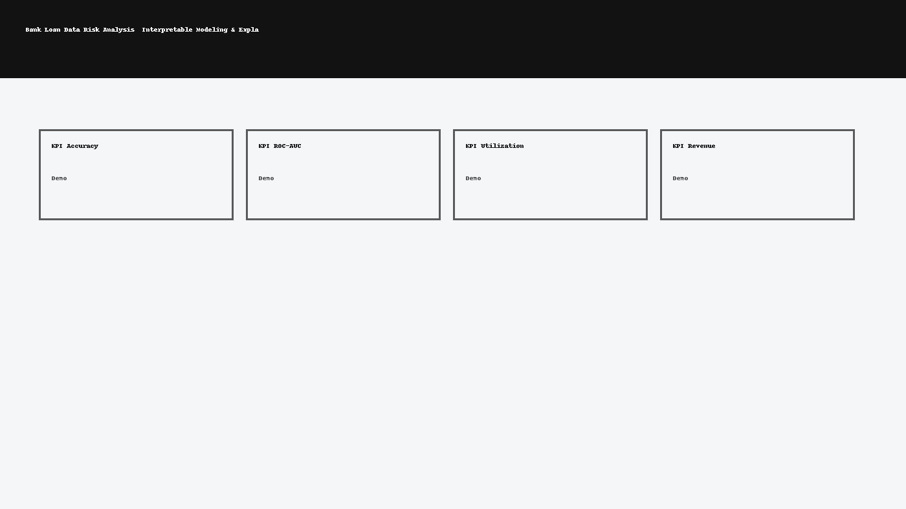

<p align="left">
  <a href="https://www.python.org/"></a>
  <a href="#"></a>
  <a href="https://github.com/emilio027/Bank-Loan-Data-Analysis/actions"></a>
  <a href="https://github.com/emilio027/Bank-Loan-Data-Analysis/commits/main"></a>
  <a href="#"></a>
</p>

[](https://colab.research.google.com/github/emilio027/Bank-Loan-Data-Analysis/blob/main/notebooks/quickstart.ipynb)




    # Bank Loan Data Risk Analysis — Interpretable Modeling & Explainability

    ## Executive Summary
    End-to-end credit risk workflow: data cleaning, cohort EDA, feature engineering, model training, and
explainability. Combines a calibrated Logistic Regression baseline with a tree-based model for lift while
maintaining regulator-friendly interpretability (SHAP, stability checks).

    **ATS Keywords:** Python, SQL, Power BI, Tableau, Pandas, NumPy, scikit-learn, ETL, data pipeline, automation, business intelligence, KPI dashboard, predictive modeling, time series forecasting, feature engineering, stakeholder management, AWS, GitHub Actions, Streamlit, Prophet, SARIMAX, SHAP, risk analytics, calibration, cross-validation, A/B testing

    ## Skills & Tools
    - Python
- Pandas
- scikit-learn
- SHAP
- Calibration
- ROC/PR
- Brier Score
- KS statistic
- Cross-validation
- Fairness audit

    ## Deliverables
    - Cleaned dataset with documented imputations/outlier handling and leakage prevention
- Baseline Logistic model + calibrated probabilities; tree model with feature importance
- Explainability pack (global and local SHAP), scorecard-style summary
- Policy-grade PDF report with cut-off strategy and loss vs approval trade-offs

    ## Key Metrics / Evaluation
    - ROC-AUC
- PR-AUC
- Brier Score
- KS
- Calibration curves
- Segment stability

    ## How to Run
    ```bash
    python -m venv .venv && source .venv/bin/activate
    pip install -r requirements.txt
    make data
    make report
    ```
    *Law Firm demo:* `streamlit run app.py`

    ## Impact Highlights (from my work history)
    - Saved $3M by automating workflows and migrating Excel processes to SAP HANA at NRG
- Resolved data issues saving $500k annually at CenterPoint Energy
- Improved stakeholder transparency by 15% via SQL + Power BI/Tableau dashboards at Robin Hood
- Scaled an AI automation agency from $750 to $28k weekly revenue as Founder/CEO

    ## Repo Structure
    ```
    src/  notebooks/  data/{raw,processed}  models/  scripts/  tests/  docs/img/  reports/
    ```
